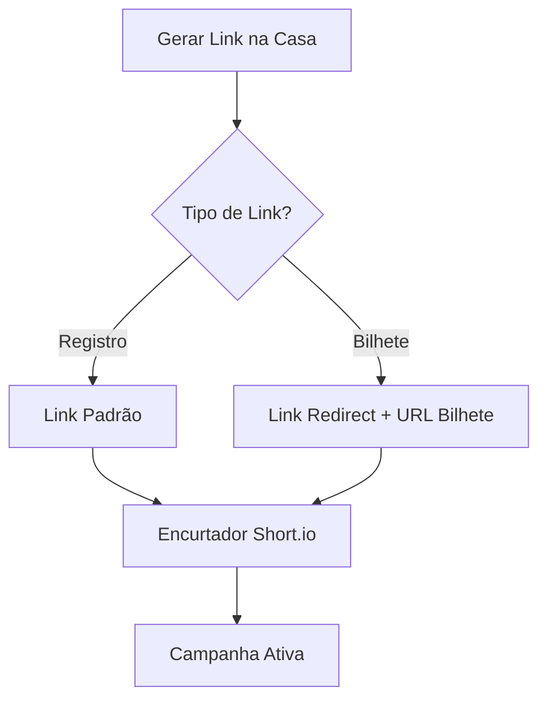

# Criação e Gestão de Links de Afiliados

## 1. Propósito
Este documento visa padronizar o processo de criação, documentação e gestão de links de afiliados em diversas plataformas parceiras. O objetivo principal é garantir consistência arquitetônica, rastreabilidade e controle rigoroso sobre os links utilizados nas campanhas de tráfego, operações de automação (bots) e demais atividades de marketing.

## 2. Escopo
Aplica-se à gestão do ciclo de vida de todos os links promocionais gerados pela operação, englobando as fases de geração na plataforma de origem, parametrização técnica, registo e auditoria.

---

## 🔴 Superbet
🔗 **Portal de Afiliados:** [Superbet Affiliates](https://wlsuperbet.adsrv.eacdn.com/)

### Estrutura de Links
| Tipo de Link | URL Base / Estrutura |
| :--- | :--- |
| **Registro** | `https://wlsuperbet.adsrv.eacdn.com/C.ashx?btag=a_5641b_431c_&affid=675&siteid=5641&adid=431&c=` |
| **Bilhete** | `...&c={campanha}&asclurl={link_final}` |

### Dicionário de Parâmetros
| Parâmetro | Função | Exemplo / Valor |
| :--- | :--- | :--- |
| `btag` | Identificação site/anúncio | `a_8538b_431c_` |
| `siteid` | ID específico do afiliado | `8538` |
| `asclurl` | URL de destino final (Deep link) | `https://www.betano.bet.br/...` |

ℹ️ **Procedimento de Geração**

1. Navegue até ao menu **Marketing Tools > Get your ads**.
2. Na secção **Tracking Profile Preferences**, selecione o afiliado/tipster.
3. Clique no botão **Update**.
4. Selecione a opção **431 (Registration Form)** e copie o URL.

---

## 🟠 Betano
🔗 **Portal de Afiliados:** [Betano Affiliates](https://kg-br.com/)

### Estrutura de Links
| Tipo de Link | URL Base / Estrutura |
| :--- | :--- |
| **Registro** | `https://kg-br.com/C.ashx?btag=a_10928b_10012c_&affid=3498&siteid=10928&adid=10012&c=` |
| **Bilhete** | `...&c={contexto}&asclurl={link_final}` |

### Dicionário de Parâmetros
| Parâmetro | Função | Exemplo / Valor |
| :--- | :--- | :--- |
| `affid` | ID da conta principal | `3498` |
| `siteid` | ID específico do afiliado | `10928` |
| `adid` | ID do anúncio | `10012` (Padrão) |

ℹ️ **Procedimento de Geração**

1. Navegue até **Marketing Tools > Get your ads** e clique em **Update**.
2. Selecione a opção **10012 (Registration Form)**.
3. Copie o URL gerado a partir do campo **AdSearch_DirectLink**.

---

## 🟣 Novibet
🔗 **Portal de Afiliados:** [Novibet Affiliates](https://rt.novibet.partners/)

### Dicionário de Parâmetros
| Parâmetro | Função | Regra de Preenchimento |
| :--- | :--- | :--- |
| `id_da_conta` | Código da conta | TC=`HBY3-M` ou LT=`fX6eX3` |
| `lpage` | Hash da Landing Page | ex.: `isMEq3` |
| `s1` | Identificador de Campanha | `{NomeAfiliado}_{NomeCampanha}` |

⚠️ **Auditoria:** Copie o link e teste no navegador antes de distribuir.

---

## 🔵 SportingBet
🔗 **Portal de Afiliados:** [SportingBet Affiliates](https://mediaserver.entainpartners.com/)

### Regras de Negócio
| Regra | Descrição |
| :--- | :--- |
| **Tracker ID** | Cada campanha deve gerar um ID único. |
| **Nomenclatura** | Deve seguir estritamente o formato `{Afiliado-Campanha}`. |
| **Registro** | Obrigatoriedade de armazenamento na planilha de controle. |

ℹ️ **Procedimento de Geração**

1. Na aba **Banners & Links**, localize **Registration Page**.
2. Selecione o Deal (**CPA + Rev Share**) e o Bonus (**No offer**).
3. Clique em **Get Code** e copie a URL.

---

## ⚫ Blaze
🔗 **Portal de Afiliados:** [Blaze Affiliates](https://blaze.cxclick.com/)

### Parâmetros Dinâmicos
| Campo | Descrição | Observação |
| :--- | :--- | :--- |
| `bta` | ID da conta principal | LT: `53110` / TC: `53109` |
| `afp1` | Nome do Afiliado | Ex: `Lucastylty` |
| `landingPage` | URL do Bilhete | **Requer encoding duplo** |

🚫 **Atenção:** Se criar um link de bilhete, utilize obrigatoriamente a aba **Deep link**.

---

## 🟤 BetMGM
🔗 **Portal de Afiliados:** [BetMGM Affiliates](https://ntrfr.betmgm.bet.br/)

### Configuração de URL
| Parâmetro | Valor Sugerido | Finalidade |
| :--- | :--- | :--- |
| `pid` | `12817` ou `12859` | Cadastro ou Bilhetes |
| `bid` | `1519` | ID da Landing Page padrão |
| `Campaign` | Variável | **Adicionar manualmente** `&Campaign=...` |

---

## 🎯 Considerações Finais e Qualidade

| Checkpoint | Ação Necessária |
| :--- | :--- |
| ✅ **Sintaxe** | Validar caracteres `&`, `?` e `=` |
| ✅ **Verificação** | Confirmar ID e Nome do afiliado visualmente |
| ✅ **Cloaking** | Encurtar via **Short.io** para uso público |

