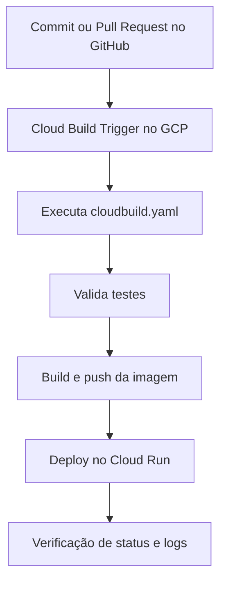

# Criação de CI/CD com GitHub e GCP Cloud Build

## 1. Propósito
Este documento padroniza a criação de um pipeline de CI/CD para repositórios GitHub usando Cloud Build Trigger no GCP. O foco é deixar o fluxo reproduzível, auditável e fácil de validar.

## 2. Escopo
Aplica-se à configuração do arquivo `cloudbuild.yaml`, à criação do trigger no Google Cloud e à verificação de que o pipeline executou corretamente após um push ou pull request. Teste o link em [[gestao-links]]

---

## 🟢 Visão Geral do Fluxo

| Etapa | O que acontece |
| :--- | :--- |
| **1. Configuração** | Você cria o arquivo `cloudbuild.yaml` na raiz do repositório. |
| **2. Integração** | Você conecta o repositório GitHub ao Cloud Build. |
| **3. Execução** | Um push ou PR dispara o trigger no GCP. |
| **4. Validação** | Você confere logs, status e resultado final do deploy. |

---

## ✅ Pré-requisitos

| Item | Observação |
| :--- | :--- |
| Projeto no GCP | Precisa ter billing ativo. |
| APIs habilitadas | Cloud Build API, Artifact Registry API e Cloud Run API, se houver deploy. |
| Repositório GitHub | Deve estar acessível para o Cloud Build. |
| Permissões | Necessárias para criar triggers e executar builds. |

ℹ️ **Recomendado**

- Branch principal protegida, normalmente `main`.
- Testes automatizados já existentes no projeto.
- Uso de Artifact Registry para armazenar imagens.

---

## 🔧 Criando o `cloudbuild.yaml`

Crie o arquivo na raiz do repositório com um pipeline simples e consistente. A estrutura abaixo cobre teste, build, push e deploy.

```yaml
steps:
	- name: 'gcr.io/cloud-builders/docker'
		id: 'Run tests'
		entrypoint: 'bash'
		args:
			- '-c'
			- |
				echo "Substitua por seus testes reais"
				# Exemplo Node: npm ci && npm test
				# Exemplo Python: pip install -r requirements.txt && pytest

	- name: 'gcr.io/cloud-builders/docker'
		id: 'Build image'
		args:
			- 'build'
			- '-t'
			- '${_REGION}-docker.pkg.dev/$PROJECT_ID/${_REPO_NAME}/${_SERVICE_NAME}:$SHORT_SHA'
			- '.'

	- name: 'gcr.io/cloud-builders/docker'
		id: 'Push image'
		args:
			- 'push'
			- '${_REGION}-docker.pkg.dev/$PROJECT_ID/${_REPO_NAME}/${_SERVICE_NAME}:$SHORT_SHA'

	- name: 'gcr.io/google.com/cloudsdktool/cloud-sdk'
		id: 'Deploy to Cloud Run'
		entrypoint: gcloud
		args:
			- run
			- deploy
			- '${_SERVICE_NAME}'
			- '--image=${_REGION}-docker.pkg.dev/$PROJECT_ID/${_REPO_NAME}/${_SERVICE_NAME}:$SHORT_SHA'
			- '--region=${_REGION}'
			- '--platform=managed'
			- '--allow-unauthenticated'

substitutions:
	_REGION: 'us-central1'
	_REPO_NAME: 'apps'
	_SERVICE_NAME: 'my-service'

options:
	logging: CLOUD_LOGGING_ONLY
```

### 📝 Dicionário da configuração

| Campo | Função | Exemplo |
| :--- | :--- | :--- |
| `_REGION` | Região do deploy | `us-central1` |
| `_REPO_NAME` | Nome do repositório no Artifact Registry | `apps` |
| `_SERVICE_NAME` | Nome do serviço no Cloud Run | `my-service` |
| `$SHORT_SHA` | Identificador curto do commit | `a1b2c3d` |

### 🚦 Regras práticas

- Use variáveis em `substitutions` para evitar duplicação.
- Mantenha o nome da imagem consistente com o serviço.
- Remova `--allow-unauthenticated` se o serviço não for público.
- Substitua o passo de teste pelos comandos reais da sua stack.

---

## 🔗 Criando o trigger no GCP

### Procedimento no Console

1. Acesse **Cloud Build > Triggers**.
2. Clique em **Create Trigger**.
3. Em **Event**, escolha o comportamento desejado:

	 | Evento | Uso |
	 | :--- | :--- |
	 | `Push to a branch` | Deploy automático após push. |
	 | `Pull request` | Validação antes do merge. |

4. Conecte sua conta GitHub, se ainda não estiver integrada.
5. Selecione o repositório correto.
6. Defina o filtro da branch, por exemplo `^main$`.
7. Em **Configuration**, selecione **Cloud Build configuration file (yaml/json)**.
8. Em **Cloud Build configuration file location**, informe `cloudbuild.yaml`.
9. Ajuste substituições adicionais, se necessário.
10. Clique em **Create**.

### 🔒 Permissões normalmente necessárias

| Papel IAM | Finalidade |
| :--- | :--- |
| `Cloud Run Admin` | Permitir o deploy no Cloud Run. |
| `Artifact Registry Writer` | Permitir push da imagem. |
| `Service Account User` | Necessário em alguns cenários de execução. |

🚫 **Atenção:** o trigger pode iniciar e ainda falhar se a service account do Cloud Build não tiver acesso aos recursos do deploy.

---

## 🧪 Como verificar se o CI/CD rodou bem

### No Cloud Build

1. Acesse **Cloud Build > History**.
2. Abra a última execução do trigger.
3. Confira se o status final está como `Success`.
4. Valide os logs de cada etapa:

	 | Step | O que verificar |
	 | :--- | :--- |
	 | `Run tests` | Se os testes rodaram sem erro. |
	 | `Build image` | Se a imagem foi gerada corretamente. |
	 | `Push image` | Se a imagem foi enviada ao Artifact Registry. |
	 | `Deploy to Cloud Run` | Se a nova revisão foi publicada. |

### No GitHub

- Confirme o check do Cloud Build no commit ou pull request.
- O status deve aparecer como concluído com sucesso.

### No destino final

- Abra o Cloud Run e confirme a nova revisão.
- Teste o endpoint da aplicação.
- Verifique logs iniciais se houver qualquer comportamento inesperado.

---

## 🚨 Troubleshooting rápido

| Problema | Causa provável | Correção |
| :--- | :--- | :--- |
| Trigger não dispara | Branch ou evento incorretos | Revise o regex e o tipo de evento. |
| Falha no push da imagem | Permissão insuficiente | Ajuste IAM da service account. |
| Deploy falha no Cloud Run | Papel IAM ausente | Garanta `Cloud Run Admin`. |
| Testes não executam | Comando errado no YAML | Substitua pelo comando real do projeto. |

---

## 🎯 Considerações Finais e Qualidade

| Checkpoint | Ação necessária |
| :--- | :--- |
| ✅ **Sintaxe** | Validar indentação e nomes dos campos no YAML. |
| ✅ **Trigger** | Confirmar branch, evento e caminho do arquivo. |
| ✅ **Execução** | Validar logs, status e revisão criada. |
| ✅ **Deploy** | Testar o serviço final após a pipeline. |

ℹ️ **Resumo do fluxo**

1. Você versiona o `cloudbuild.yaml` no GitHub.
2. O trigger do GCP detecta o push ou PR.
3. O Cloud Build executa testes, build, push e deploy.
4. Você confere a execução em Cloud Build History e no serviço final.



